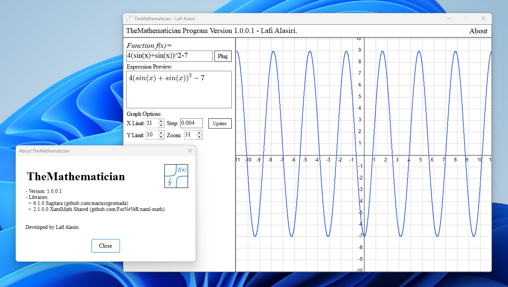

# TheMathematician - A Hobby Project Made by Lafi Alasiri.
TheMathematician is a simple function plotter program that visualizes functions made in C# for entertainment purposes.

# Pros and Cons
- Depends on the [mXparser](https://github.com/mariuszgromada/MathParser.org-mXparser) parser which provides full confidence in writing equations.
- Slow in performance only when graphing functions.
- Displaying options are limited.
- Cannot display numerous functions, it only displays the f(x) function.
- Open source project with no restrictions.

# How To Use?
1. write your function in the 'function f(x)' input.
2. Click on 'plug' button to graph the function.
3. If you want to expand drawing limits, adjust the 'X Limit' and 'Y Limit', given that the maximum amount of value for each option is 100.

# Libraries
- [6.1.0 Sagitara mXparser](https://github.com/mariuszgromada/MathParser.org-mXparser)
- [2.1.0 XAML-Math Expression Displaier](https://github.com/ForNeVeR/xaml-math)

# Disclaimer

This project is only made for entertainment purposes, and the intention behind it is completely non-commercial and it is open source for anyone.
